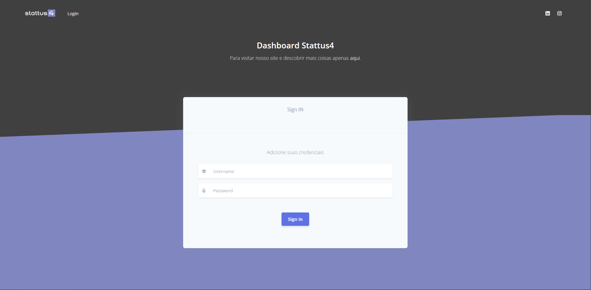
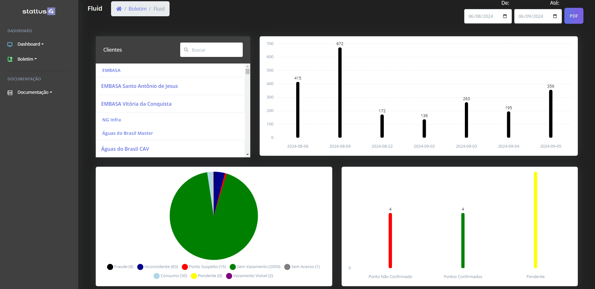
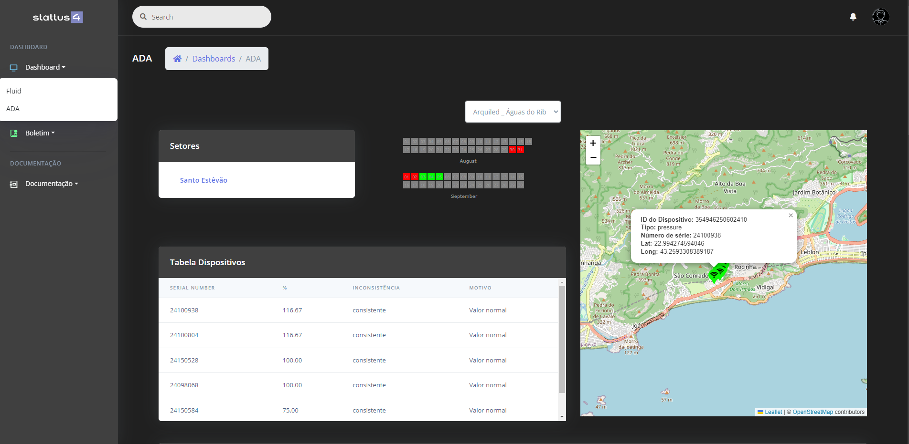

# Django Dashboard for Stattus4

## Introduction

This project is a dashboard developed with Django, a Python web framework. The dashboard is designed for Stattus4, providing a web interface to visualize, monitor, and manage data collected from sensors and devices connected to a smart city network.

## Features

- **Data Visualization:** Graphical interface to display real-time data collected from sensors.
- **Filtering and Search:** Tools to filter and search for specific data.
- **User Authentication:** Login system and access control.
- **Device Configuration:** Interface to add, update, and remove connected devices.
- **Reports and Charts:** Generation of reports and charts based on collected data.

## Requirements

- Python 3.8 or higher
- Django 3.2 or higher
- PostgreSQL (or another relational database compatible with Django)

